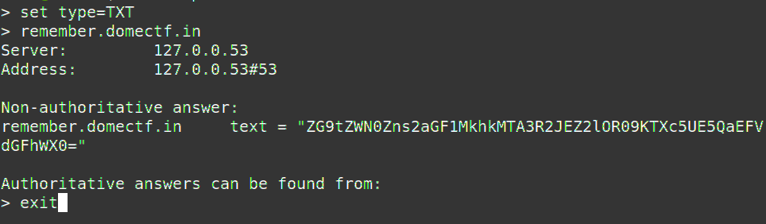

## <u>Remember CTF</u>

The remember CTF had a clue with a famous sentence by William Shakespeare "What's in the name?"

It was obvious that the flag must be something related to domain name. So we thought of DNS record and since data is usually put in TXT record we directly queried the TXT record using nslookup and found the flag :)

~ By @kr33pt
