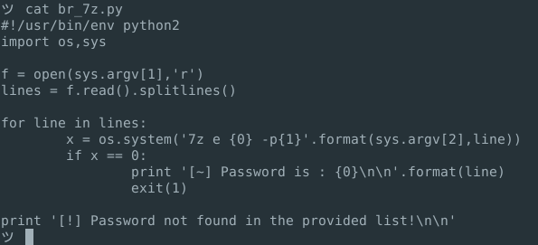

## <u>Weapon Store</u> 

Link 1 > https://weapon-store.domectf.in

Website looks very basic single webpage.
We tried URL Fuzzing to find out hidden directories & Server side script, But no luck with that.

index.html page of website was having around 9 images, so first thing came in mind is steagnography.

For a quick check I downloaded all 9 images, checked for any hidden files.

Ran binwalk to identify magic strings of files.

 

 It was a 900 bytes 7z file, I directly tried extracting file... but it was pwd protected :(

 
 "dd if=some.7z"

 Before participating in CTF I read previous year domectf writeups, there was some challenges which was unlocked by simple passwords such as "domectf" "c0c0n" etc.
 So I tried all the possible & related password but no luck.

 After some time my teammate suggested to run "strings" on 7z file. (Results were interesting.)

 
 7z file contained a string at the end (ofcourse after 7z trailers.)

 "<b>..dO YOu think This SEnteNcE IS boriNG bUt tHe pASsworD Has a stRoNg COnneCTiOn wiTH tHIs sentenCE..</b>"

 My first thought was , might be this time password is simple just like before but there can be a case juggling involved. (But this is not what challenge creator meant)

 So I quickly searched for code snippet which can case juggle a word and echo all possible combination.

 I used following script
 

 Now I needed a script which can try all password I created ... googled a little and was able to find following script (This runs in single thread.. not good for CTF scenarios)
 

 And created a wrapper for both script which will check the supplied word.

 

 And one after other I tried all the possible words , and all I got is failure.

 

 Also tried All caps and all small letter from the clue string.

 After wasting lot of time, we got closer to solution.
 Converted all the character from clue string to binary ie Capital will be "1" and small would be "0"

 Now total length of binary string was 80, Yeeeee!!
 Password could be of 10 character.
 So quickly converted binary to ascii but all we got was gibberish text.

 Searched little more and tried to find all the subsitutional algo which converts Binary like string to text.. And found Baconian. This algo takes 5 binary input and convert it to a character [A-Z]

 Using https://www.dcode.fr/bacon-cipher

 

 Using the password we got folder "bacon_for_you" this contains our flag.

 

 :) Challenge was interesting. 

