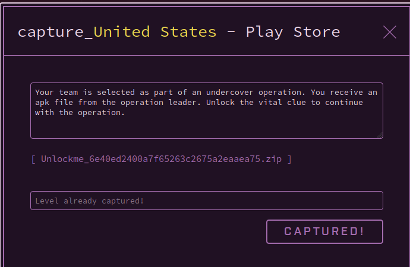
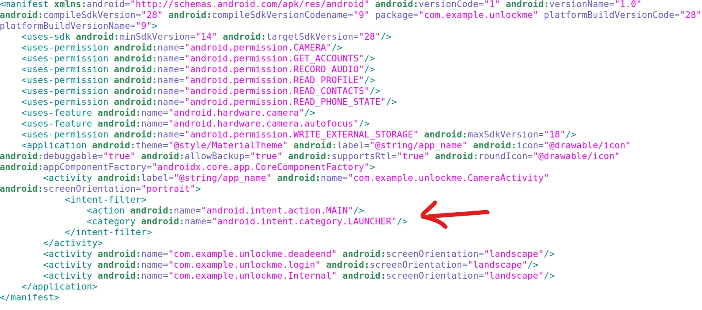
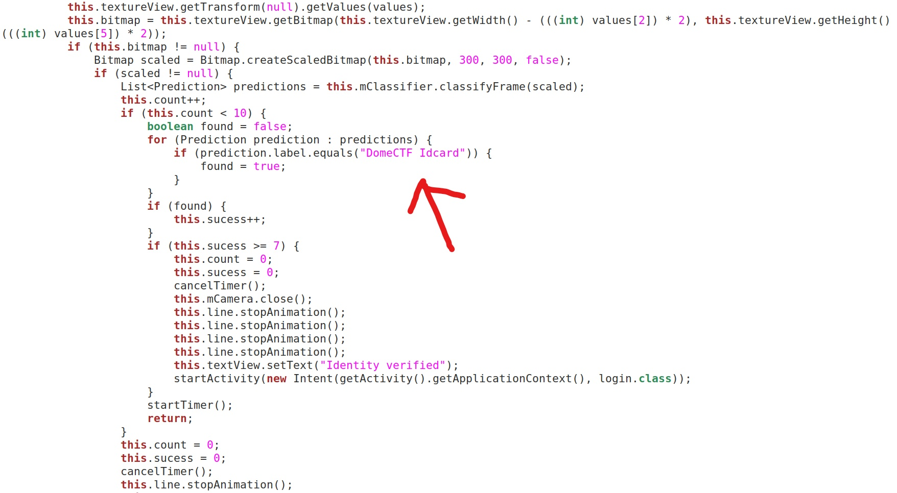
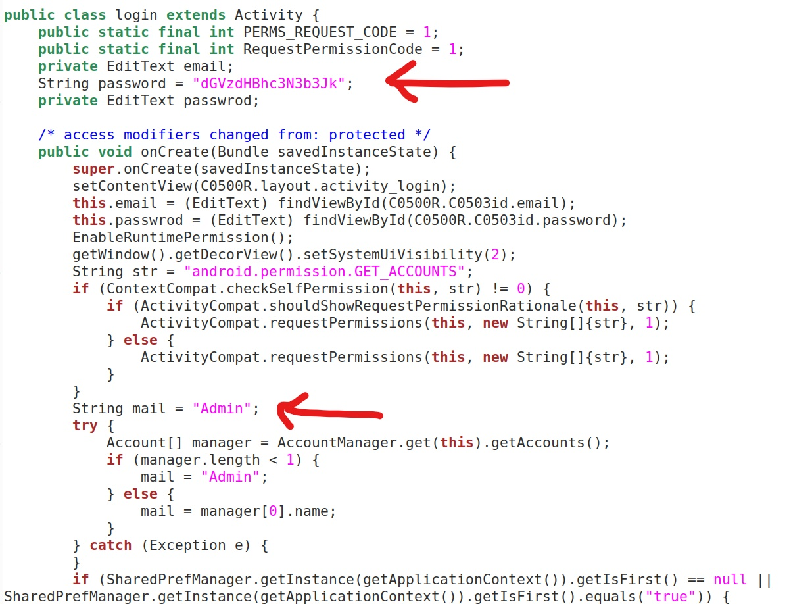
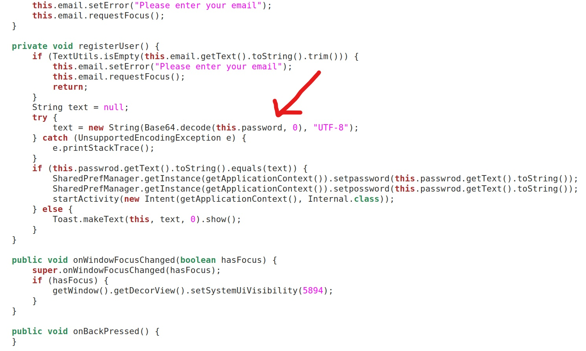
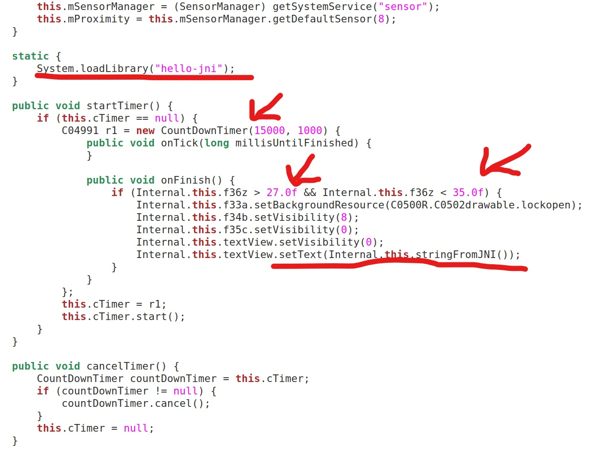

## <u>UnlockMe CTF</u>

The "United States - Play Store"  CTF is based on Android. An APK is provided and we have to find the flag in that APK.

First it was simple to Decompile the APK. We used JADX De-compiler to decompile the APK. We obtained the source code from the APK.

Reading the Android Manifest file it was clear that the first activity which was launched is  CameraActivity.

Reading the java files related to CameraActivity we can see that the activity needs us to scan the CTF Badge given to us to move to the next step.

After scanning the ID Card we are redirected to the login screen.  On analysing the Login java file we can see that the username is Admin and the password is Base64 encode. After decoding the base64 string we got the password which is "**testpassword**".

After logging in using the obtained password we get to a screen with has a compass like layout with an image of a key in the middle. On reading the code of the Java file (Internal.java) we can see that this function loads a library file (**hello-jni**) and calls a function **stringFromJNI()** only if some conditions are satisfied (Keep the angle of the compass between **27 degree** and **35 degree** and activate the proximity sensor for few seconds). So we figured that this is where the Flag is. 

We thought that there were 3 options for us.

* Reverse the .SO file to obtain the flag.

* Create a new APK to just call the function from the .SO file bypassing all the constraints.

* Perform all the steps in the current APK to satisfy the constraints and let the app display the flag.

Since we did not have an Android development environment setup we went for the 3rd step. We installed the APK on our mobile phone. Showed it our CTF Badge. Logged in using the username **Admin** and password **testpassword**. Kept the key compass at an angle between **27 degree** and **35 degree** and kept our finger on the proximity sensor for few seconds and we got the CTF flag pop up on the screen :)